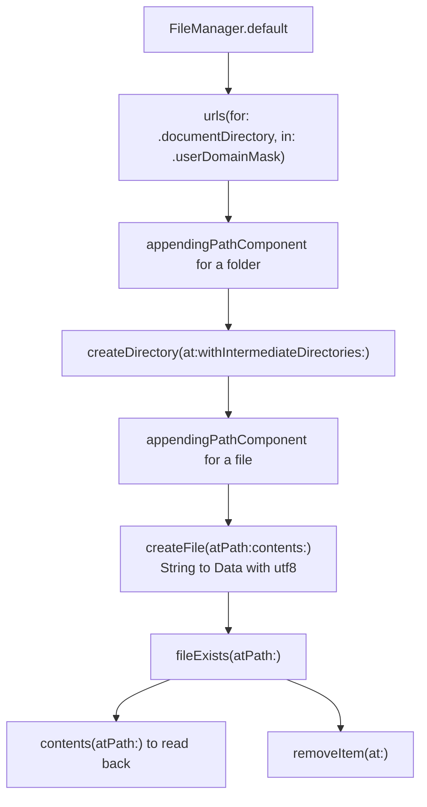

# FileManager

*The full set of file system operations an application actually needs.*

    

## Overview

Locating the documents directory, creating folders including nested ones, writing a file, reading it back, checking existence and deleting. Each operation is kept as a separate readable step rather than hidden behind a helper.

## How it works



## Implementation notes

- **Documents, not the bundle.** The app bundle is read only, so anything written at runtime belongs in the documents directory, which is what the first call resolves.
- **Intermediate directories.** Passing `withIntermediateDirectories: true` creates a whole path in one call, which is the difference between working and failing on a nested folder.
- **Existence checked before deletion.** `removeItem` throws on a missing path, so the check is not optional in practice.
- **Strings converted explicitly.** Text is encoded to `Data` with UTF-8 before writing, making the encoding a decision rather than a default.

## Project structure

```
FileManager/
└── ViewController.swift
```

## Requirements

Xcode 15 or later, iOS 18.0 or later. No external dependencies.
